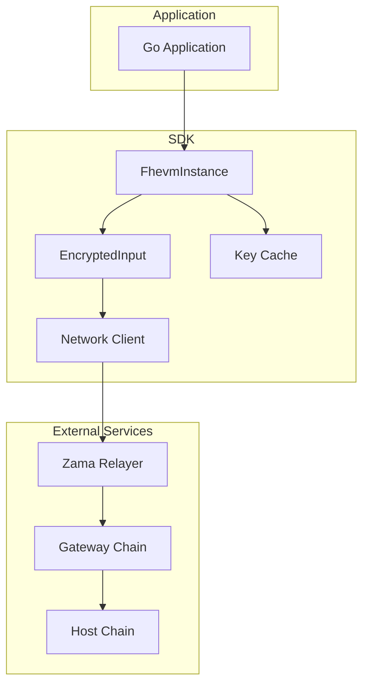
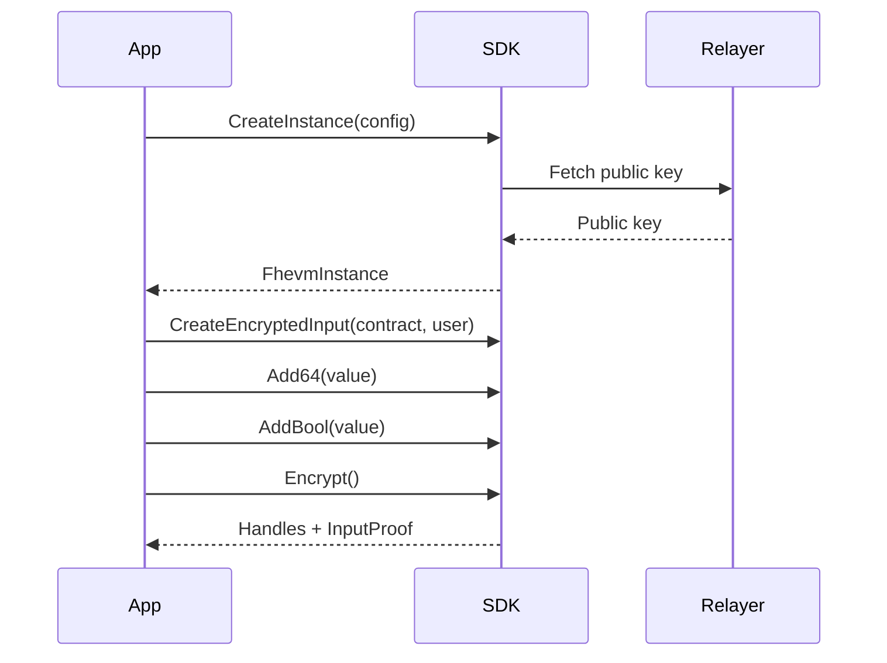

# Zama Golang Relayer SDK

Go SDK for FHEVM (Fully Homomorphic Encryption Virtual Machine) relayer integration.

## Overview

This SDK provides Go bindings for encrypting values compatible with FHE-enabled smart contracts. It communicates with the Zama relayer service for public key retrieval and input encryption.

## Installation

```bash
go get github.com/PrivaraXYZ/zama-golang-relayer-sdk
```

Requires Go 1.24 or later.

## Quick Start

```go
package main

import (
    "context"
    "log"
    "math/big"

    "github.com/PrivaraXYZ/zama-golang-relayer-sdk/pkg/relayer"
)

func main() {
    ctx := context.Background()

    instance, err := relayer.CreateInstance(ctx, relayer.SepoliaConfig)
    if err != nil {
        log.Fatal(err)
    }

    input := instance.CreateEncryptedInput(
        "0xContractAddress...",
        "0xUserAddress...",
    )

    input.Add64(big.NewInt(12345)).AddBool(true)

    result, err := input.Encrypt(ctx)
    if err != nil {
        log.Fatal(err)
    }

    // Use result.Handles and result.InputProof in contract calls
}
```

## Architecture



## Encryption Flow



## API

### CreateInstance

```go
instance, err := relayer.CreateInstance(ctx, relayer.SepoliaConfig)
```

### EncryptedInput Builder

| Method | Description |
|--------|-------------|
| `Add64(value *big.Int)` | Add uint64 value |
| `AddBool(value bool)` | Add boolean value |
| `AddAddress(addr string)` | Add Ethereum address |
| `Encrypt(ctx)` | Execute encryption |

### EncryptResult

```go
type EncryptResult struct {
    Handles    [][]byte  // Encrypted value handles
    InputProof []byte    // Cryptographic proof
}
```

## Supported Networks

| Network | Chain ID |
|---------|----------|
| Sepolia | 11155111 |

## Project Structure

```
pkg/
  relayer/     Core SDK
  crypto/      Key management
  network/     HTTP client
  errors/      Error types
internal/
  utils/       Address utilities
examples/      Usage examples
```

## Development

```bash
make build    # Build
make test     # Run tests
make lint     # Run linter
```

## Status

Release candidate (v0.1.0-rc.1) with mock encryption.
Real TFHE encryption planned for v0.2.0.

## Contributing

See [CONTRIBUTING.md](./CONTRIBUTING.md).

## License

BSD-3-Clause - See [LICENSE](./LICENSE).
