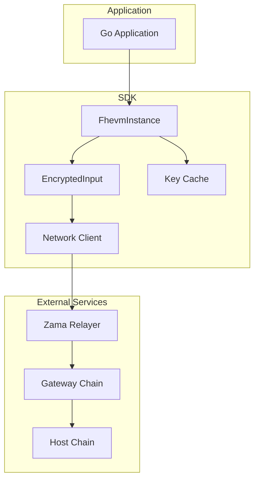
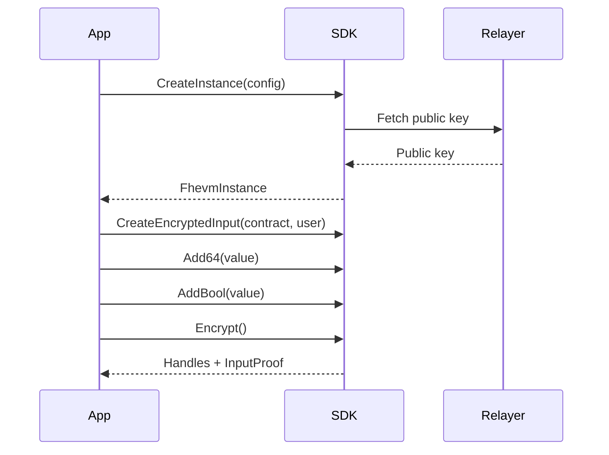

# Zama Golang Relayer SDK

Go SDK for FHEVM (Fully Homomorphic Encryption Virtual Machine) relayer integration.

## Overview

This SDK provides Go bindings for encrypting values compatible with FHE-enabled smart contracts. It communicates with the Zama relayer service for public key retrieval and input encryption.

## Installation

```bash
go get github.com/PrivaraXYZ/zama-golang-relayer-sdk
```

Requires Go 1.24 or later.

## Quick Start

```go
package main

import (
    "context"
    "log"
    "math/big"

    "github.com/PrivaraXYZ/zama-golang-relayer-sdk/pkg/relayer"
)

func main() {
    ctx := context.Background()

    // Get Sepolia configuration
    config, err := relayer.SepoliaConfig()
    if err != nil {
        log.Fatal(err)
    }

    // Create FHEVM instance
    instance, err := relayer.CreateInstance(ctx, config)
    if err != nil {
        log.Fatal(err)
    }

    // Create encrypted input (validates addresses at creation)
    input, err := instance.CreateEncryptedInput(
        "0xContractAddress...",
        "0xUserAddress...",
    )
    if err != nil {
        log.Fatal(err)
    }

    // Add values (type-safe, no errors)
    input.AddUint64(12345)
    input.AddBool(true)

    // For addresses, create Address value object first
    addr, err := relayer.NewAddress("0xRecipient...")
    if err != nil {
        log.Fatal(err)
    }
    input.AddAddress(addr)

    // Encrypt all values
    result, err := input.Encrypt(ctx)
    if err != nil {
        log.Fatal(err)
    }

    // Use result.Handles and result.InputProof in contract calls
}
```

## Architecture



## Encryption Flow



## API

### Configuration

```go
// 1. Sepolia testnet with defaults
config, err := relayer.SepoliaConfig()

// 2. Sepolia with custom options
config, err := relayer.SepoliaConfig(
    relayer.WithTimeout(60 * time.Second),
    relayer.WithMaxRetries(5),
    relayer.WithCustomRelayerURL("https://my-relayer.com"),
)

// 3. Custom network
config, err := relayer.NewCustomConfig(
    chainID,
    gatewayChainID,
    relayerURL,
    networkURL,
    relayer.WithTimeout(45 * time.Second),
)
```

### CreateInstance

```go
config, err := relayer.SepoliaConfig()
instance, err := relayer.CreateInstance(ctx, config)
```

### Available Options

| Option | Description |
|--------|-------------|
| `WithTimeout(duration)` | Set HTTP request timeout |
| `WithMaxRetries(n)` | Set maximum retry attempts |
| `WithCustomRelayerURL(url)` | Override relayer URL |
| `WithCustomNetworkURL(url)` | Override network RPC URL |
| `WithAuth(credentials)` | Set authentication |

### EncryptedInput Entity

| Method | Description |
|--------|-------------|
| `AddUint64(value uint64)` | Add uint64 value (type-safe, no errors) |
| `AddBool(value bool)` | Add boolean value (type-safe, no errors) |
| `AddAddress(addr Address)` | Add validated Address value object |
| `Encrypt(ctx) (*EncryptResult, error)` | Execute encryption |

### Address Value Object

| Function | Description |
|----------|-------------|
| `NewAddress(addr string) (Address, error)` | Create validated Address |
| `String() string` | Get string representation |
| `Bytes() ([]byte, error)` | Convert to bytes |
| `Equals(other Address) bool` | Check equality |

### EncryptResult

```go
type EncryptResult struct {
    Handles    [][]byte  // Encrypted value handles
    InputProof []byte    // Cryptographic proof
}
```

## Supported Networks

| Network | Chain ID |
|---------|----------|
| Sepolia | 11155111 |

## Project Structure

```
pkg/
  relayer/     Core SDK
  crypto/      Key management
  network/     HTTP client
  errors/      Error types
internal/
  utils/       Address utilities
examples/      Usage examples
```

## Development

```bash
make build    # Build
make test     # Run tests
make lint     # Run linter
```

## Status

Release candidate (v0.1.0-rc.1) with mock encryption.
Real TFHE encryption planned for v0.2.0.

## Contributing

See [CONTRIBUTING.md](./CONTRIBUTING.md).

## License

BSD-3-Clause - See [LICENSE](./LICENSE).
